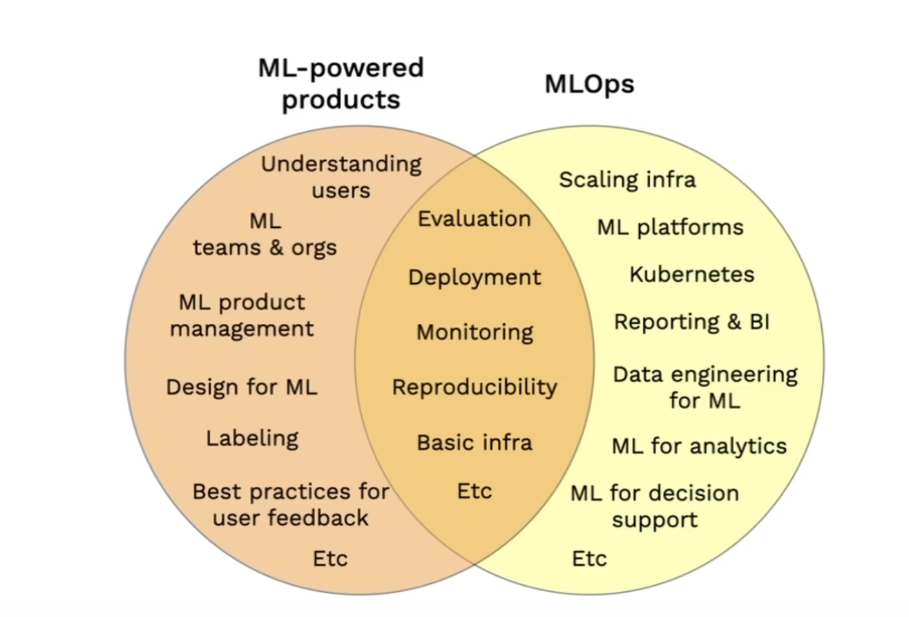
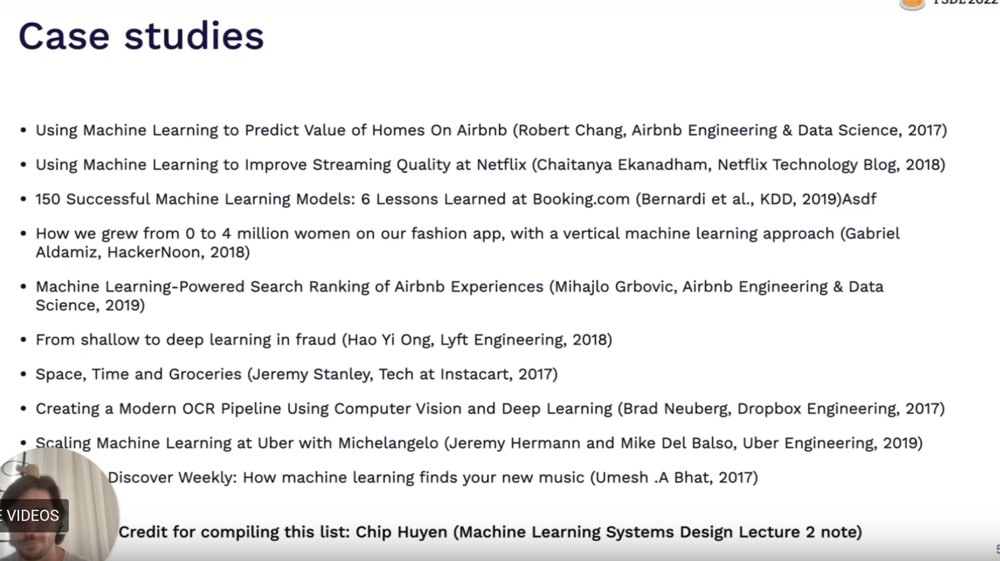
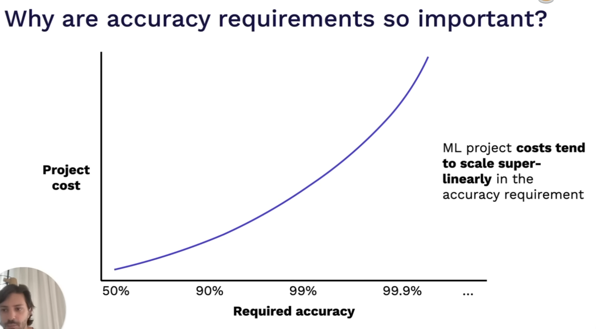
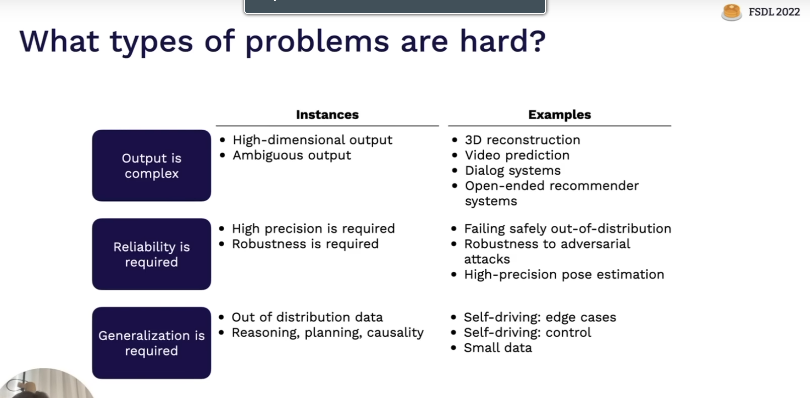
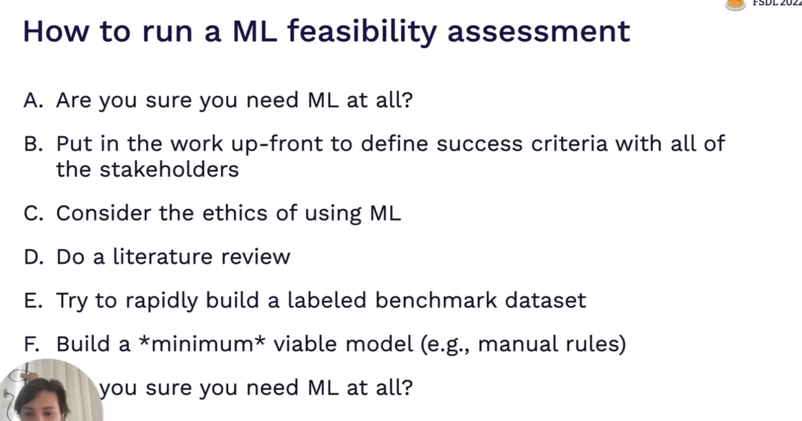
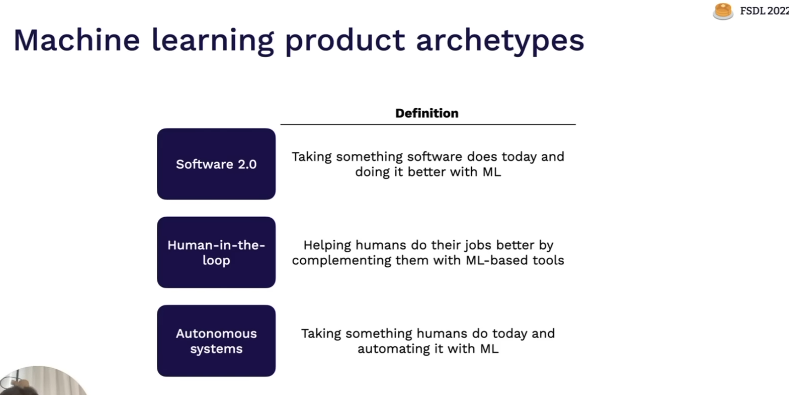
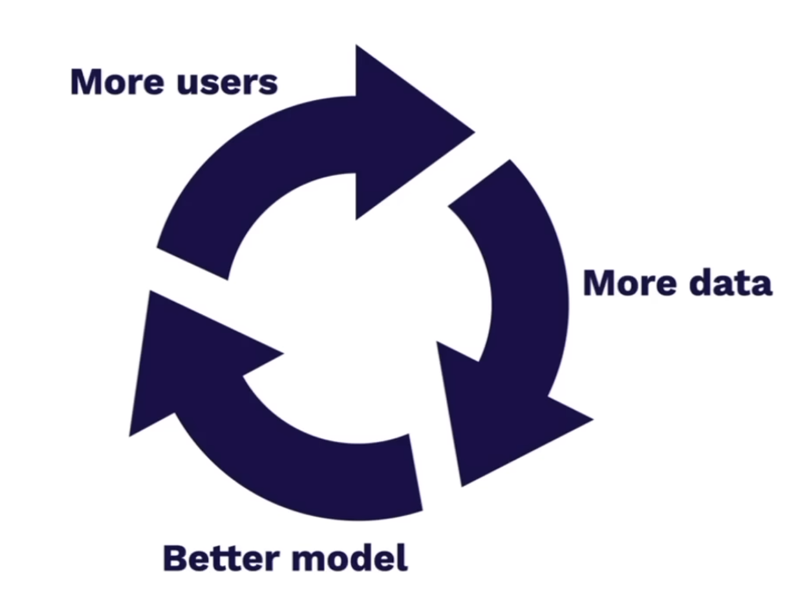
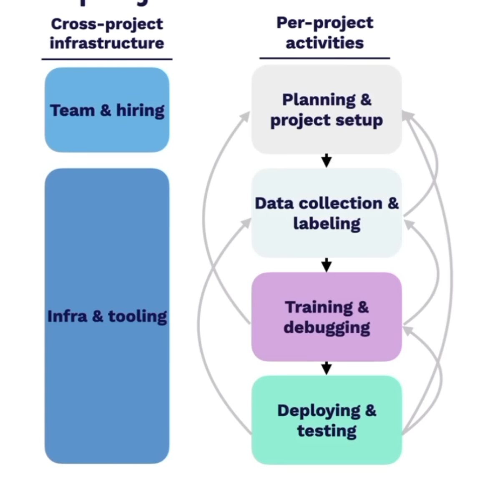

# Full Stack Deep Learning 

## Lecture 1 

## Topic : Course Vision and Introduction to Machine learning Projects

### What this course will be about 

- Avoiding AI winters - by making research output as usable products for commercial purpose 

- This course will be about how to make ML powered Products 

- Generalist skillset - MLOps additional gain 

- Best practices about ML Delpyments and Product design 

- Forming community to learn about new technologies and practices 

### What this course will not be about 

- This is not a ML Course - No hard theories will be covered 
- Don't aim for covering fundamentals through this course 
- Models are not important here, how to convert models to products is 
- No specific expertise fields here 
- MLOps will be covered by not comprehensively 

We will see how to build an E2E products with ML 

### MLOps 

- Practices and infra to build models in repetable, scalable and robust automated way 

**Josh Tobin - Founder of Gantry** 

### When to use Machine Learning 

- Since ML Products include a lot of complexities - Exhaust all other avenues before using ML 

- ML Projects have a much higher failure rates - it is not 87% lol - More like 25% 

- Why do these projects fail ? 
    - Fundamentally they are research oriented - explorations 
    - Technically infeasible 
    - Take too long to produce value 
    - Poor scoping of project 
    - Easy to make models - Hard to make them servable at scale 
    - No clear success criteria
    - Many projects don't solve big enough problem - Cost to value is not positive 

Technical Debts of ML Powered Projects 
- High rate of techincal debt 
- Expesive Data collection process 
- Incompetent DS folks writing garbage code 
- Constant need for model monitoring 

### Questions to ask before applying ML in a problem. 

- Business Value:  

    Is the problem we are trying to solve substantial enough to offset the cost of deployoment and monitoring of the ML Based solution

- Ehtics and Regulations:

    Is is even ethically possible to use ML in this situation? Biases, Data Privacy, regulations and other HR Bullshit 

- Readyness :

    Are you ready to use ML frameworks - Do you have the resources and the infrastructure needed to deploy a ML Solution 

- Problem Complexity : 

    Do you even need ML for this problem. Trying simple statistical methods before using ML is a good idea. It can be the case that you might not even need ML when simple rule based systems can get you the business value that you need. 

### How to choose Problmes to solve with ML 

- High Impact and low costs 

    - Friction in product 
    - Complex Pipeline parts 
    - When cheap predictions are valuable 
    - What other people are doing in your industry 

### Is the Machine learning project Feasible ?

- Low Cost and High Impact 

What do we mean with High Impact ?

- What problems become cheaper to solve - ML can reduce the time to prediction - Reducing the time taken to make a decision by removing a human in the loop 

- Cheap Predictions - See areas where the cost of hiring humans to make simple decisions can be automated - using ML models to make decisions 

- What problems are ML Models good at ? If you have problems that are easily solved by ML - Apply ML There 

- Eliminating complex rule systems by using ML 

- Look at what others are doing in their industry with ML - What problems are being solved by ML - Reading Blogs and papers from the top companies 

### How to assess the cost of ML Projects 

- Data Availability 

    - How easy is it to acquire the data for the problem 
    - Do we have the data already
    - If we have to acquire data, how hard will it be to acquire and label data ? 
    - How stable is the data ? Does the data changes over time ? Drift and concept drift 
    - How much data do you need for the problem ? 
    - What are the data security requirements ? Are there regulations 

- Accuracy Requirements 

    - What level of accuracy with make the project feasible 
    - What is the cost of wrong prediction ? Eg Self driving car vs Recommendation engines 
    - How frequent does the system need to be right in order to be valuable ? DallE vs Medical Predicitions 
    - Ethical Implications of making incorrect predictions

- Inherent Difficulty of the Problem 

    - Certain problems which are inherently hard to solve will be costlier to solve even with ML - Linear Regression : Fine, Building ChatGPT ? Not so sure
    - Has this problem been solved before 
    - If solved before, how much computations did it take to solve the problem 
    - Can a human solve this problem ? Generally easier if human can solve the problem 

Every additional 9 added to the requirement generally leads to **10X** cost increase 

**Feasibility in ML** 

This is a challenging concept purely due to the rate at which the research moves in the field. What is a complex problem for some years is converted into a API call problem after a few years progress. 

**Feasiblility Check for ML** 

### Questions about Software 2.0 Problems and Human in Loop Problems 

- What is the baseline performance without ML 
- Does performance improvement generate business value ? 
- Do we require a data flywheel ?
- How good does the system have to be for it to be useful? 
- How do you collect data for the problem ?

### Questions about the autonomous systems 

- What is the accetable failure rate in system ? 
- How do you guarentee that the failure rate wont exceed the given threshold ? 

### Data Flywheel 

You require an automated way to acquire more data from the users and generate labels for the collected data

## Lifecycle for a ML Product 

- Planning and Project Scoping 

    - Decide the problem to pursure 
    - Decide the performance requirements 
    - Resource Allocation for the project 
    - Consider the legal and ethical implications for the project 

- Data Collection and Labelling 

    - Setting up / figure out how to gather data 
    - Set up the labelling framework 

- Training and Debugging 

    - Implement the baseline 
    - Find sota and reproduce 
    - Debug implementation
    - Improve the model based on feedback from baseline 

- Deployment and Testing Model 

    - Monitoring the Model in production for performance and degradation of performance 
    - Deploying model for serving to the target audience 
    - Testing the model for checkin the reliability 

