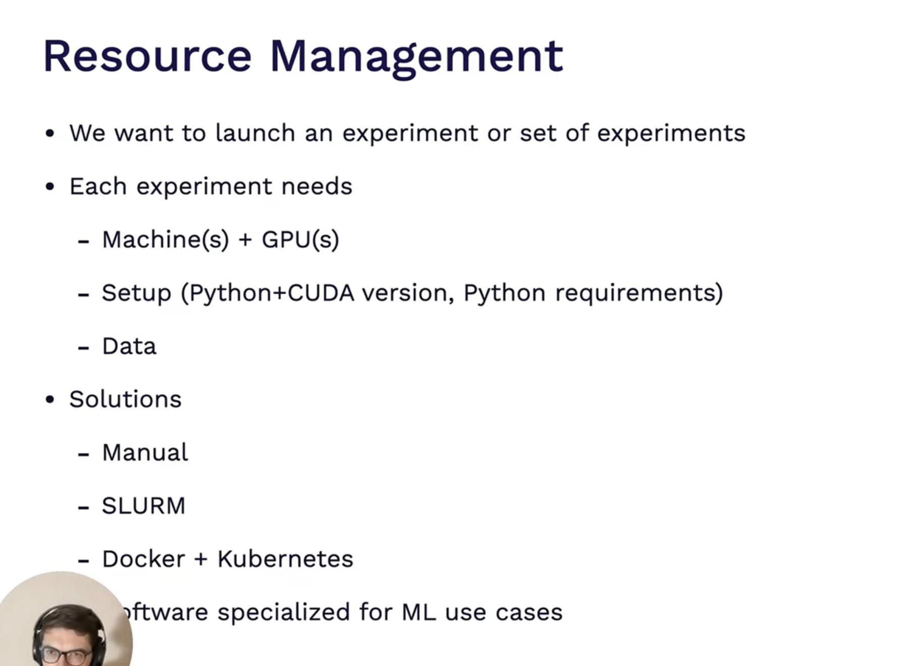
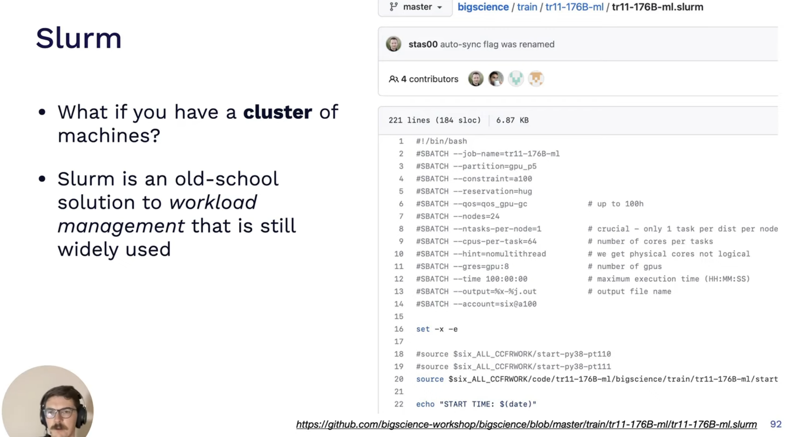

# Development Infrastructure and Tooling

We Want to keep the environments separate for production and Development. We 
achieve this by using **YAML** files. 

## Deep Learning Frameworks 

- FSDL has a tool that compares the cloud GPU performances and you can see individual specifications 

Cost per hour can be cheaper - but since it may take longer to learn, it will cost you more overall during training 

Generally, you want to choose the highest costing per hour and then choose the provider that offers it at minimum cost 

So choose the best gpu and lest expensive provider 

You can build your own or get a pre-built -> Lambda Labs is one provider 

## Resource Management 

 

Slurm is a workload Management platoform - when you have a cluster of machines that you want to train your model on 

Kubernetes and Kubeflow 

About Sagemaker :

It makes sense if you already are using AWS 

AnyScale 

GridAI 

Determined.AI

## Experiment Management 

MLFLOW :

W and B : 

## Hyper Parameter Tuning : 

## All in One Solutions 

Sagemaker, Gradient PaperSpace, Domino Datalabs
